# Jira Clone
Access To Live Project: [https://www.jira-herman.tk](https://www.jira-herman.tk)

## Description

This project attempts to clone the issue and project tracking application known as Jira. 
More specifically, the application and website are implemented, including the user interface, RESTful API, authentication functionality, and data store requirements.

## Technologies Used
- Ubuntu 22.04
- Node v18.2.0
- Express 4.17.2
- PostgreSQL 13.4
- Redis v6.0.16
- React 17.0.2
- HTML + CSS
- JavaScript
- AWS EC2, RDS, S3, ALB

## Application Overview
As an application meant to faciliate project management and issue tracking, this clone of Jira allows users to fetch, create, delete, and modify issues. In addition, users can modify project and user settings (such as name and user image).

The user must first log in or register to access the project in Jira.

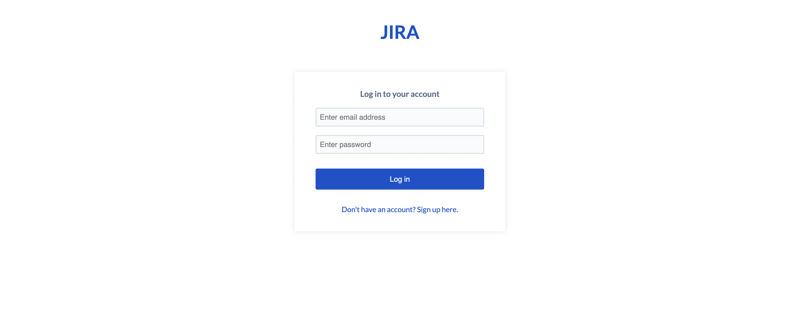

Once the user is logged in, the main page is loaded. This page displays a side bar, navigation bar, and the kanban board displaying all issues in the columns corresponding to their statuses.

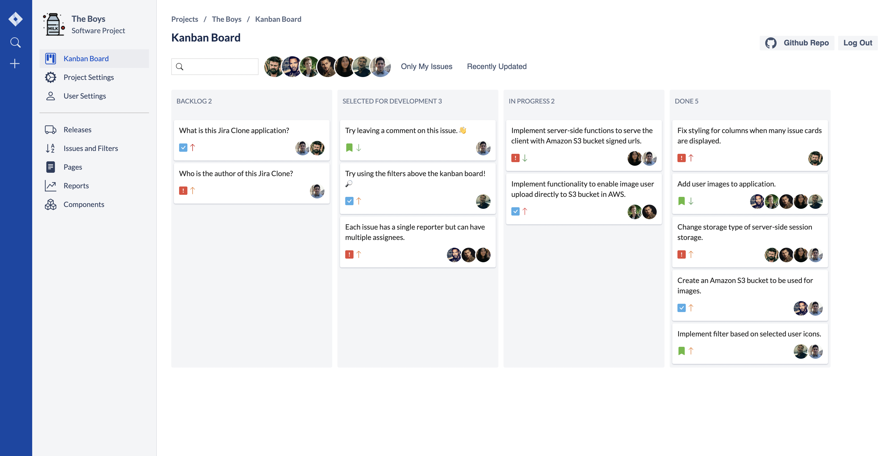

Through the sidebar (in blue) to the left of the page, the user has access to several actions including a text-based search, and the ability to create a new issue. Upon clicking the + icon, a modal is displayed with different fields used to initialize the issue information. This includes fields for the following: type, priority, summary, description, reporter, and assignees.

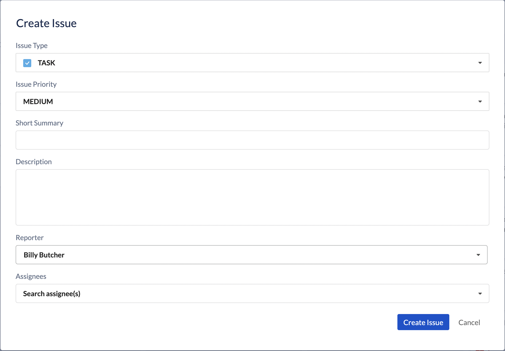

Text-based search looks for a string match in the issue summary or description:
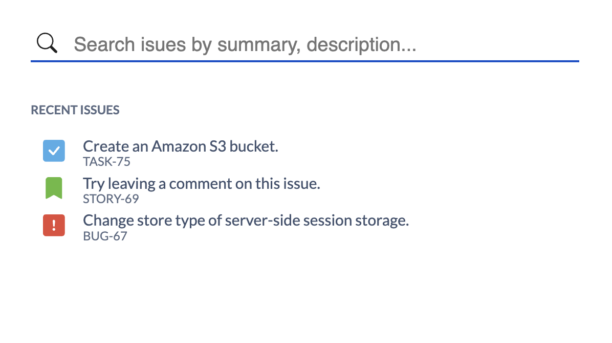

In addition to the functionality available through the sidebar, the user can also filter the issues displayed in the kanban board using different methods:
- Assignee(s) Filter: Click on one or more user images to view only issues pertaining to the selected user(s).
- Summary Text Filter: Type in text in the search bar which will be matched against issue summaries.
- My Issues Filter: Click on 'Only My Issues' button to display only issues of logged in user.
- Recently Updated Filter: Click on 'Recently Updated' button to display issues recently modifed.

It is worth noting that these filters are layered when more than one is used. When one or more filters are active, they can be cleared from kanban board using the 'Clear All' button displayed at the end of the line.

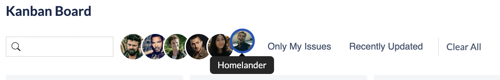

In order to modify an issue status, one simply click and drag an issue card to the target status column, or click on the issue card which will open a modal displaying all relevant data.

Click and drag: 
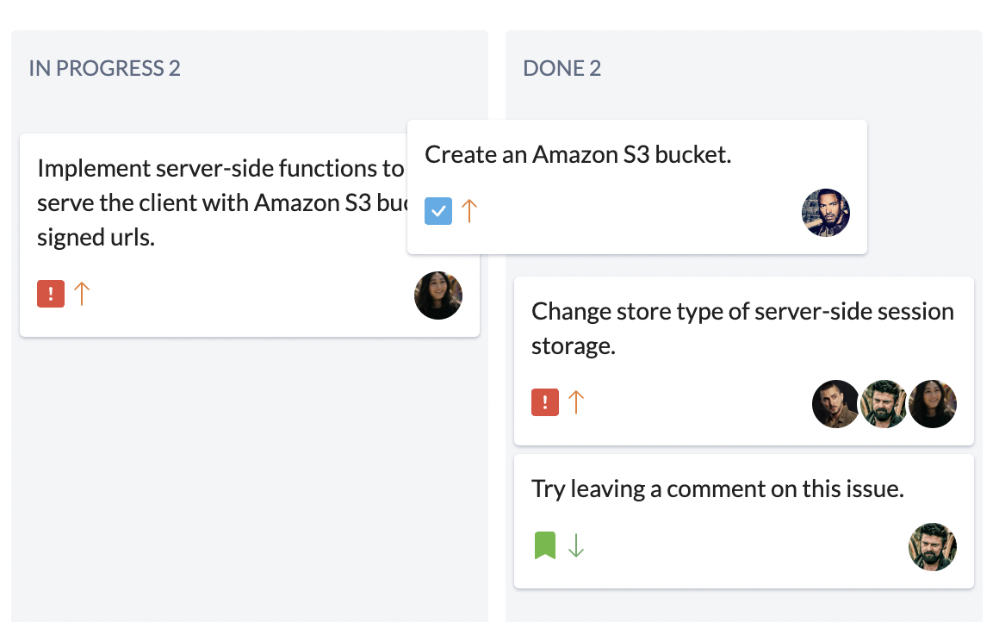

By clicking on an issue card, a modal pops up which displays all issue fields including type, summary, description, status, reporter,assignees, and priority—all of which can be modified. In addition, the modal consists of a comments section where the user can view existing comments and enter a new comment.

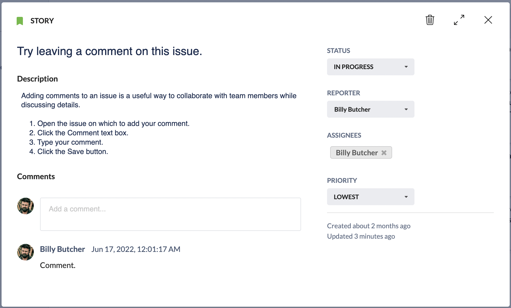

On the upper right corner of the modal, the user is able to delete the issue, expand the issue (navigating to a different view), and close the modal. By expanding the issue, a page is loaded in which only the issue information is displayed. This page is shareable via url with other project team members.

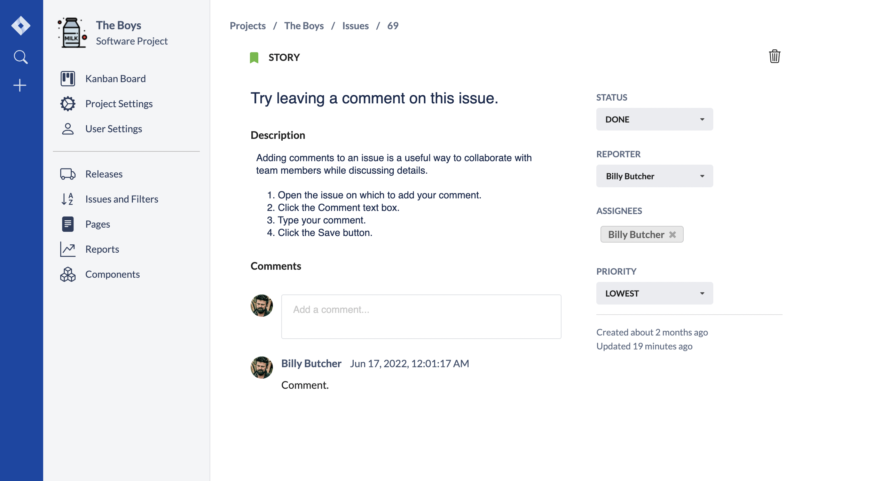

The navigation bar allows the user to navigate to the kanban board, project settings, and user settings pages. For this clone, the other listed items (Releases, Issues and Filters, Pages, Reports, and Components) are not implemented.

In the project settings page, one can modify the project name, URL, category, and description:
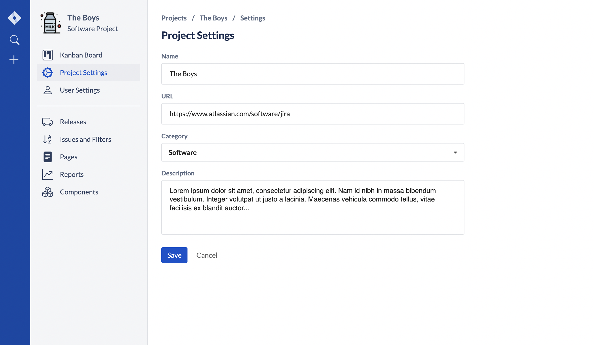

In the user settings page, one can modify the name of the user, and the image used in the application. 
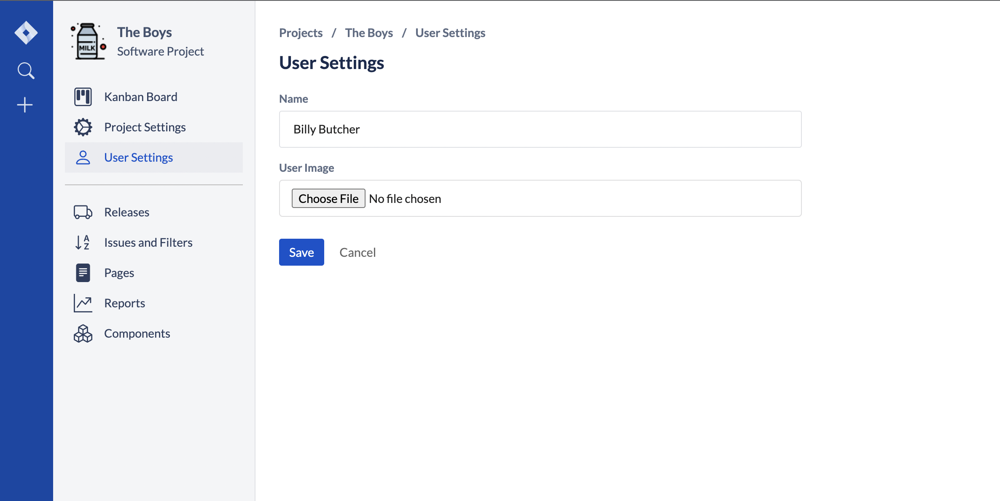

## System Design Technical Documentation

## Back-End

On the backend, the tech stack consists of Node.js, Express, PostgreSQL, Redis, and several Amazon Web Services to make this application cloud-native. Though this application could have been created without cloud services, I found that deploying the application using AWS was valuable for reasons I will touch on later in this summary.

### Data Modeling
The first step I took in developing the Jira clone was to determine the type of data that would need to be persisted in order to narrow down options for a suitable data store. 
All issues created in Jira are relational in nature—each has a status, reporter, priority, type, title, description, comments, and assignees. So I chose to go with a relational database. After reviewing the workflow of existing Jira clones and the fields collected, I created an Entity Relationship Diagram (ERD) to depict the relationships among the entities and their attributes. 

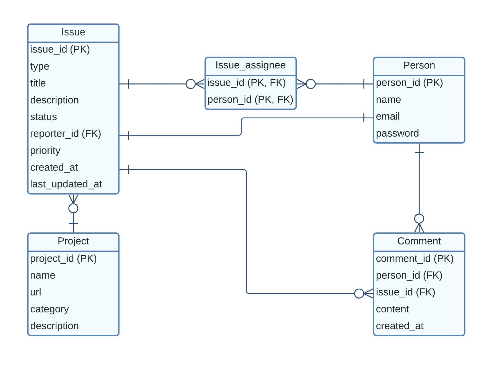

Entities (aka tables) were created for the following: Issue, Comment, Issue Assignee, Person/User, and Project. Each with its own attributes, and primary key.

For the ERD above, a many-to-many—the relationship exists between an issue and a person. An issue can have more than one assignee, and one user can have more than one issue it is assigned to. To represent this, a junction table was created titled Issue Assignee, which consists of composite primary keys using the issue id and the person id.

After designing the data model, it was time to bring it to life. I decided to use PostgreSQL as the relational database management system for its speed, security, and robustness. It also offers certain features other RDBMs do not offer—such as creating user-defined types, which I used for certain entity attributes.

For the initial phase of development, I wanted to quickly deploy the database so I could start server-side development right away. In order to do this, I locally created and ran a Docker container based on the PostgreSQL image. In this PostgreSQL instance, I created the modeled database above using SQL commands to create tables, create data types, and define constraints.

### Back-End Development
After creating a local development setup using PostgreSQL with Docker, it was time to start implementing the server-side code. This part of development involved the following:
1. REST API
    - Expose HTTP endpoints to support GET/POST/PUT/DELETE operations on application resources.
1. Internal API for PostgreSQL database server queries
    - Queries API used internally by application server.
1. S3 API
1. Authentication middleware
1. Cookies/Sessions

The REST API endpoints were implemented using the Express web application framework. Different routes were mapped to different handler functions based on the URI (path) and specific HTTP request method. Routes were created for the following: users, issues, comments, projects, and image uploads via S3.

- api/users
    - Routes for user registration, login, fetching users, updating user info, and deleting users.
- api/issues
    - Routes for creating/deleting/fetching/updating issues, and fetching issue assignees.
- api/comments
    - Routes for creating/deleting/fetching/updating comments.
- api/projects
    - Routes for creating/deleting/fetching/updating projects.
- api/uploads (S3)
    - Routes for fetching signed urls used for fetching uploaded objects (images) directly from AWS S3 bucket, and for fetching signed urls for uploading objects (images) directly to AWS S3 bucket.

In most cases, the client’s request to the server deals with resources stored in the PostgreSQL database. In order to access the database server for different queries, I implemented a library for the server to use. In it, functions were implemented to support the intent of the routes above across all resources.

In addition to database-related operations, the client may also request signed urls to make requests directly to the AWS S3 bucket used for image storage and uploads. Hence the api/uploads routes were added to be handled by the application server.

To protect the routes above, a form of authentication had to be incorporated. A user is authenticated in the context of the web application if the user is logged in successfully. However, to add stateful information to the user experience, the server must be able to keep track of the user’s state—this is where sessions come in.

Route protection and authentication was achieved using the express-session module. With this module, session middleware can be created which allows the server to store the user’s state in either memory or a database.

When the user logs in, the server creates a session and stores it. It responds to the client request and sends a cookie with the session’s unique id. Subsequent requests from the client will send this cookie to the server, where a look-up will be carried out to find the corresponding session data. It is important to note that session data is not saved in the cookie itself, just the session ID.

Session configuration:
- name: sessionID
- saveUninitialized: false
- resave: false
- store: redisStore
- secret: xxx

With the session configuration above, the name of the session ID cookie set in the response and read in the request is sessionID. With saveUnitialized set to false, if a session is newly created but not modified, then it is not stored. Note that the session is modified upon user login/registration. This was set to false in order to reduce server storage usage.

The resave attribute determines whether or not the session should be saved back to the session store even if it was never modified during the request. This was set to false to avoid any race conditions in the case where a client makes two parallel requests to the server and session changes overwrite each other. The default server-side session storage is MemoryStore, which is not meant for a production environment due to potential memory leaks and its inability to scale. Thus, I decided to use redis since all operations are performed in memory (meaning reads/writes are fast) and it also persists session state by backing up data to the disk. The secret attribute simply specifies a secret to sign the session ID cookie with in order to prevent tampering. It is used to hash the session, protecting it against session hijacking.

Session ID cookie configuration:
- httpOnly: true
- secure: false
- sameSite: lax
- maxAge: 60 minutes

With the cookie configuration above, the cookie is sent securely as it is not accessible to client-side JavaScript and is only sent to the server. This helps prevent cross-site scripting (XSS) attacks, a security exploit which allows an attacker to inject into a website malicious client-side code (and potentially steal the user’s cookie).

The Secure attribute is set to false, as the server will not be receiving HTTPS traffic directly with the architecture adopted—more on this as we dive into AWS. The SameSite attribute is set to ‘lax’ to allow the cookie to be sent if a user navigates to the web page from another site. The cookie is also set to expire after 60 mins.

By using sessions in conjunction with cookies, the application is able to save user state and keep the user logged in.

### Deployment and AWS

My first step was to determine where to deploy the server-side code to make the REST API accessible, and where to deploy the front-end to serve the static files to clients.

Deploying both to separate servers has its advantages: back-end/front-end can be scaled independently, and improved performance as servers have dedicated roles. Deploying to the same server has its own set of advantages: one server to maintain, less resources/expenses, and same domain.

Ultimately, I chose to deploy both to a single server since I do not anticipate a lot of traffic and the need to scale up. This will simplify server configuration while keeping the entire application in one place.

In order to familiarize myself more with AWS, I decided to look for deployment options in that direction. Through the AWS site, I found that with Amazon EC2 instances, developers are able to easily configure computing capacity—to choose instance types based on operating system, storage size, memory, and more.

Currently, I only have access to Free Tier AWS resources which limits the instance types I can use. However, noting EC2 flexibility for different workloads, I thought it would be valuable to go this route to get hands-on experience with such services.

After creating an EC2 instance with the Ubuntu linux distribution installed, I then installed the runtime environment and dependencies required for the application. This included Node.js, Redis, nginx, and git to clone the repository.

For the database, I used Amazon RDS to set up and deploy a PostgreSQL database. With RDS, time-consuming administrative tasks such as software installation and upgrades, replication, and backups are managed by AWS.

Establishing the rules for access to both the EC2 instance and PostgreSQL database server was simple through the use of security groups.

A security group in AWS acts as a virtual firewall, controlling the traffic that is allowed to reach and leave the resources it’s associated with.

The security group associated with the EC2 instance controls the inbound/outbound traffic for the instance. Since this instance hosts the application web server, the security group was configured to allow HTTP and HTTPS access from any IP address. In addition, since the application makes AWS API requests to AWS S3 (where the application’s image uploads are stored), it must include AWS credentials in its requests to S3. Instead of storing the credentials directly within the instance, I created an IAM role with access to the S3 bucket and associated it to the EC2 instance. A role in AWS supplies temporary permissions that the application can use when making calls to other AWS resources. In other words, the application running on this EC2 instance can use the role-supplied temporary credentials to sign API requests to the S3 bucket.

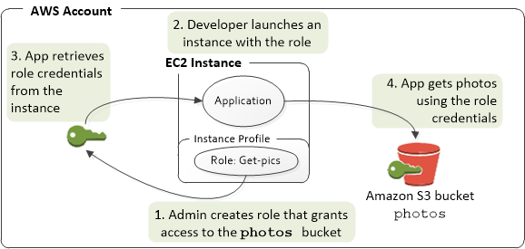

As for the database server, the inbound rule of this security group was configured to allow traffic from the security group of the EC2 instance. This means it allows access from any traffic of the EC2 instance.

After establishing the rules of traffic for the AWS resources, the site needed to be secured with HTTPS in order to protect the integrity and confidentiality of data between the client and the site. With HTTPS, network communication is encrypted and website identity is established.

Part of enabling HTTPS for the site involved obtaining a SSL/TLS server certificate. Fortunately, AWS has a service for that named Certificate Manager which lets developers provision, manage, and deploy certificates. After requesting a certificate, it must be deployed to a resource. And after reading more about enabling HTTPS, I came across documentation about SSL offloading.

SSL offloading refers to having an application load balancer with an HTTPS listener, which enables traffic encryption between the load balancer and the clients that initiate SSL/TLS sessions. The load balancer uses the server certificate to terminate the front-end connection and then decrypt requests from the clients before sending them to the target (i.e., the EC2 instance).

Thus, I created an application load balancer, and deployed the certificate to it. With this architecture	in place, the encryption/decryption of traffic is handled by the load balancer, the certificate is stored securely and regularly rotated automatically by AWS, and the EC2 instance has no encryption-related overhead.

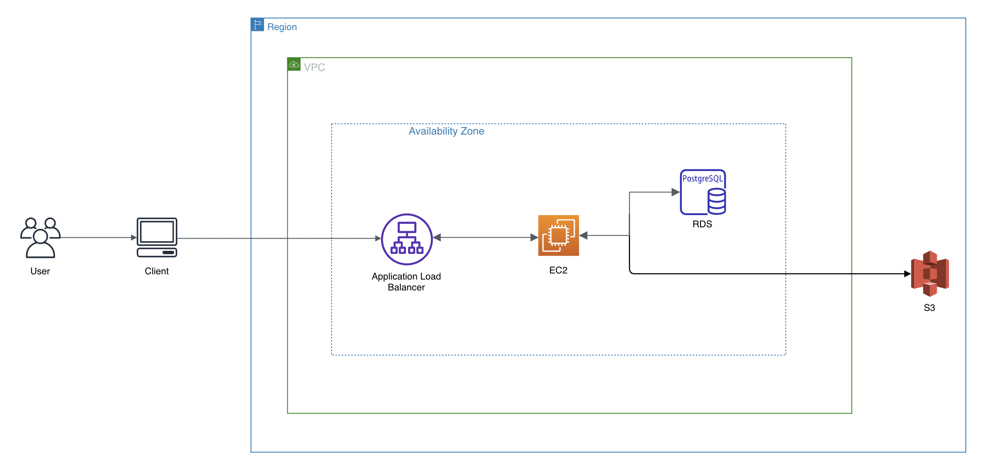

Above is a diagram of the application architecture.

## Front-End

The first step I took towards developing the UI was compiling a list of the different pages I wanted to implement in this clone.

The five main pages are the following: Login/Registration, Kanban Board, Profile Settings, User Settings, and Issue View.

In order to implement the client-facing side of the application, I needed to use a library or framework that would facilitate all the user interactions on the front-end—which includes clicking/dragging issue cards, fetching user data, updating issues, and more. Since the application does not simply serve static data but rather presents a user interface in which data that can be created and modified by the user, the complexity is increased. Due to this complexity, I decided to use the React library to build the user interfaces in a Single Page Application (SPA) as it makes it easy to build performant and dynamic web applications.

With React, a web application is made up of multiple components, with each component having its own logic, state, and potential nested components. Each component outputs a reusable piece of HTML which can be reused wherever needed.

Since there are multiple “pages” in this SPA, my next step was to take a ”page-by-page” approach in determining which components to implement in order to serve as the building blocks of each page, and finding how to eliminate redundancy in component implementation through re-usability. By re-using components, the application becomes easier to develop and maintain.

Taking a top-to-bottom approach, I first implemented the higher-level components (such as the parent components of each page) then implemented the nested, child components that made up the rest of the page.

For some of the trickier components necessary in the application, I found libraries that helped with their implementation. To create the kanban board columns and its click-and-drag functionality, I used react-beautiful-dnd. To implement modals, I used react-modal. To implement certain pop-up messages and dropdowns, I made use of some the components provided by the Semantic-UI framework. And so forth.

For user navigation, I used routes to render the corresponding components based on the path. These paths are the following:
- Path: '/'
    - Renders the Login/Registration route (with a redirect to the Kanban Board page if logged in).
- Path: ‘/project’
    - Renders the Kanban Board route.
    - Main component when logged in which user views issue cards in corresponding status columns.
    - User can click on issue cards to modify and view latest data.
- Path: ‘/project/issue/:id’
    - Renders the Issue View route.
    - Component in which user can view issue using whole screen as opposed to through a modal.
- Path: ‘/project/settings’
    - Renders the Project Settings route.
    - Component in which user can view and modify project information.
- Path: ‘/project/user-settings’
    - Renders User Settings route.
    - Component in which user can modify user name and upload a profile image.

It is worth noting that all components in this application were created using React hooks in functional components instead of class components. With Hooks, the functional components can be written with simpler code while maintaining the same access to React state and lifecycle methods.

In addition to the creating the components, API library functions were also implemented on the client-side to allow making requests to the server. For this effort, I created an instance of axios (a promise-based HTTP client) with a custom configuration which specifies the baseURL (based on the server). Using this instance, I implemented the functions necessary for login/registration functionality, and for the CRUD operations enabled by the user interface.

Ultimately, to deploy the front-end I had to create a production build of the application using the npm run build command. This builds the app for production to a build folder. The files in this folder are then served to the client from a location that a web server (such as Nginx or Apache) knows about.

With the back-end running and the front-end ready to be served, I then had to configure a web server to handle incoming requests. More specifically, to configure an HTTP listener that routes requests to the corresponding resources in the server (i.e., the static files for the client-side application or the REST API endpoints that serve as the back-end) based on the location. For this application, I used Nginx to set up a reverse proxy to implement this behavior.

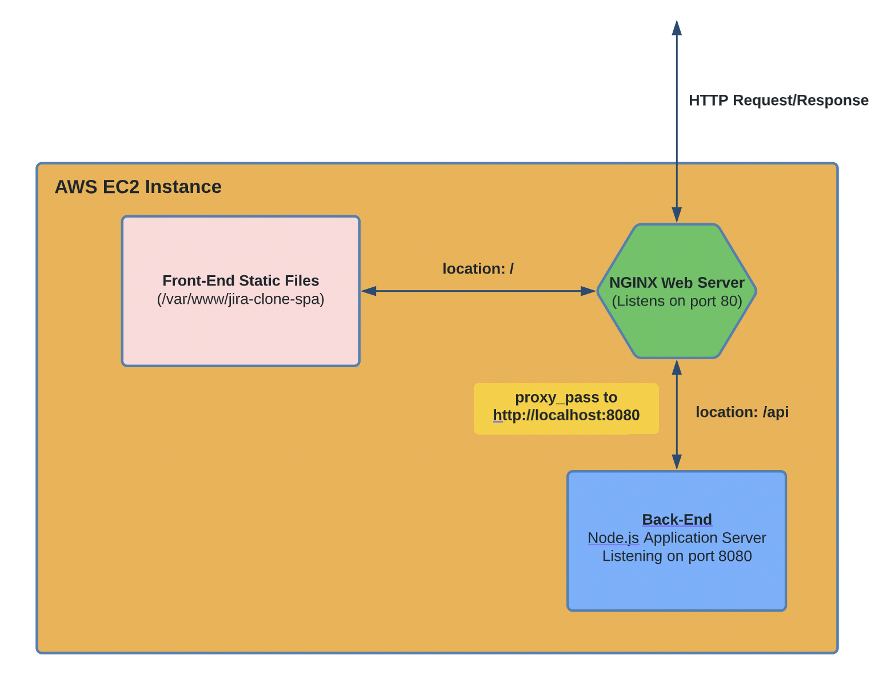